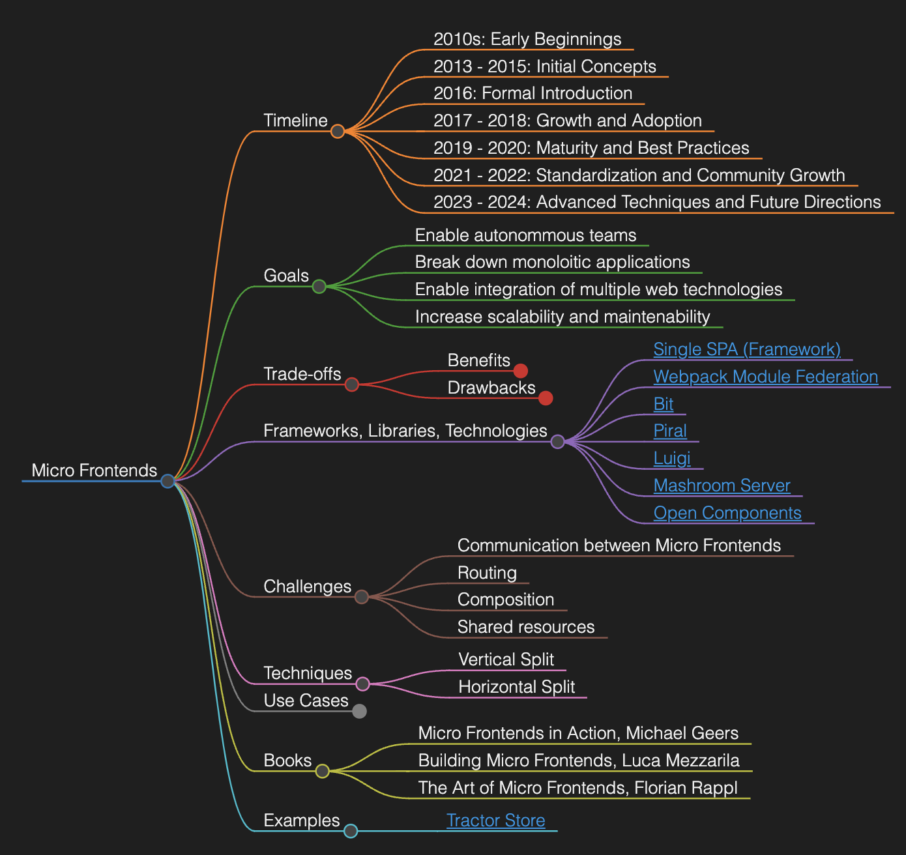

# Micro Frontends documentation

This repository contains the documentation for Micro Frontends, a Software Architecture pattern/style that following a set of techniques, allows frontend applications to be built as a composition of smaller, independently deployable units. [View repository](https://github.com/codesandtags/microfrontend-documentation).

## Table of Contents

- [Timeline](docs/timeline.md)
- [Overview](docs/overview.md)
- [Content about Micro Frontends](docs/content.md)
- [Books](docs/books.md)
- [Use Cases](docs/use-cases.md)
- [Best Practices](docs/best-practices.md)
- [Frameworks and libraries](docs/frameworks-and-libraries.md)
- [Decision Tree](docs/decision-tree.md)
- [Quotes](docs/quotes.md)
- [Global events](docs/events.md)

## Micro Frontends Mindmap

